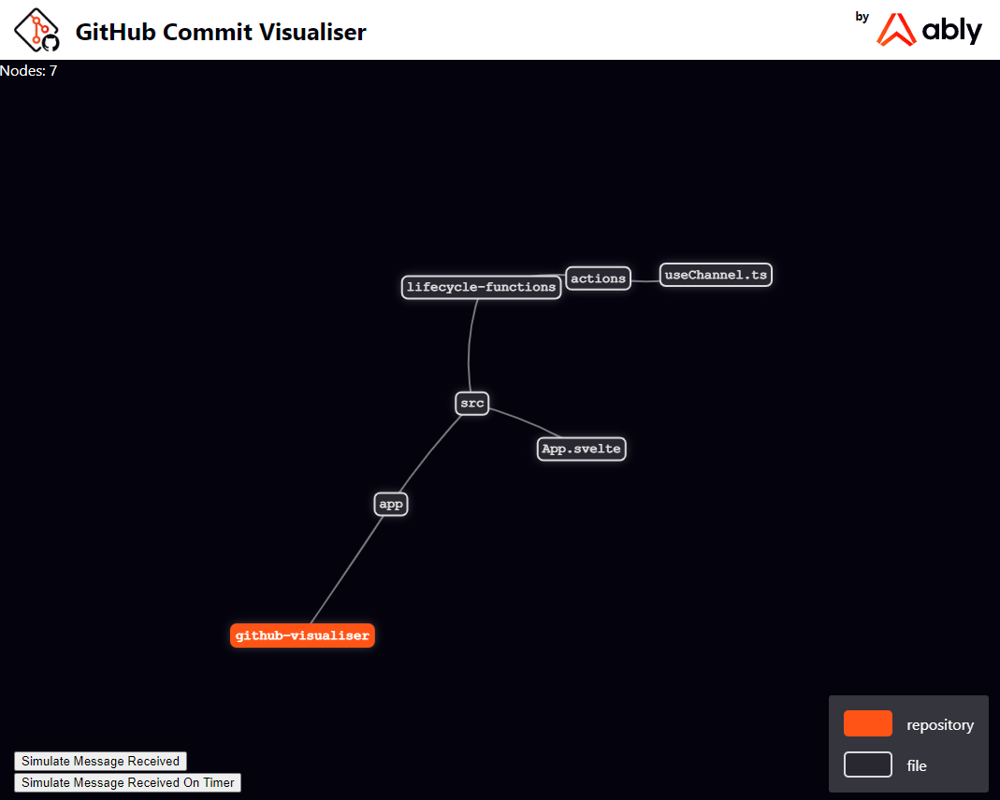

# GitHub Visualizer

A Real-Time GitHub commit visualizer inspired by [Gource](https://gource.io/), written in [Svelte](https://svelte.dev/), [vis.js](https://visjs.org/) and [Ably](https://ably.com/).

Deploying this application to a supported hosting provider gives you a real-time visualization of the commits to your GitHub organization or repository. It would be perfect for large screens, lobby displays, and places where it might be useful to see your efforts being visualised!



## Pre-requisites

- An Ably account and API key.
- A GitHub account with sufficient privileges to add a [GitHub Webhook](https://docs.github.com/en/developers/webhooks-and-events/webhooks/creating-webhooks) to your account or repository.
- A cloud service for public hosting (we're using [Netlify](https://www.netlify.com/)).
- A password of your choice, to secure your webhooks.

## Usage Overview

To use this application to visualize your own git commits, you will need to deploy the WebApp (including the bundled GitHub webhook) to a location where GitHub can call it. We suggest [Netlify](https://www.netlify.com/) or [Azure Static WebApps](https://azure.microsoft.com/en-us/services/app-service/static/), which both allow you to deploy a static web application, along with hosting bundled serverless functions from the same repository. This repository is configured to seamlessly run on both Netlify and Azure out of the box without modification.

1. Create an [Ably account and API key](#ablyaccount)
2. Create a GitHub account with sufficient privileges to add a WebHook to your account or repository
3. Fork this repository into your GitHub account
4. [Deploy with either Netlify or Azure Static Web Apps](#deploy)
  a. Add the env variable `ABLY_API_KEY` to your deployed app.
  b. Add the env variable `GITHUB_WEBHOOK_SECRET` to your deployed app (containing a password you make up)
5. Configure a GitHub Web Hook
  a. Add a GitHub webhook pointing to your deployed app - `https://your-deployed-app.com/api/github-hook` (the URL of your app will differ - but the `API` location will always be the same - `/api/github-hook`)
  b. Set the `SECRET` to the same password you configured in your applications environment variable.
6. Visit the URL and watch your commits fly in!

---

## Getting and Managing an Ably API key

<a name="ablyaccount"></a>

In order to run this app, you will need an Ably API key. If you are not already signed up, you can [sign up now for a free Ably account](https://www.ably.io/signup). Once you have an Ably account:

1. Log into your app dashboard.
2. Under **“Your apps”**, click on **“Manage app”** for any app you wish to use for this tutorial, or create a new one with the “Create New App” button.
3. Click on the **“API Keys”** tab.
4. Copy the secret **“API Key”** value from your Root key, we will use this to configure our app.

This app uses [Ably Channels](https://www.ably.io/channels) and [Token Authentication](https://www.ably.io/documentation/rest/authentication/#token-authentication).

## Configuring your Deployment, Ably API keys and Secrets

<a name="deploy"></a>

You'll need to configure settings on both GitHub and your Netlify/Azure to make this application work:

### Deployment with Netlify

<a href="https://app.netlify.com/start/deploy" style="background: url(https://www.netlify.com/img/deploy/button.svg) no-repeat center; color: transparent; display: inline-block; height: 3rem;width: 150px">Deploy to Netlify</a>

We've bundled a `netlify.toml` file in the root of the repository, which will configure your build and deployment settings.
**You will need to add two environment configuration settings** using the netlify UI:

```bash
ABLY_API_KEY=your-ably-api-key
GITHUB_WEBHOOK_SECRET=a-secret-password-that-you-make-up
```

You can configure your secrets in `netlify` by going to your app dashboard and visiting:

Site Overview > Site Settings > Build and Deploy > Environment > Environment Variables

Click on **Edit Variables** to add the values for `ABLY_API_KEY` and `GITHUB_WEBHOOK_SECRET`.

The rest of the Netlify build is configured via the `netlify.toml` file included in this repository.

### Deployment with Azure Static Web Apps

Use the [Azure Portal](https://portal.azure.com/#home) to create a new Static Web Application, select **custom**, and use the following configuration values:

```yml
    app_location: "/"
    api_location: "api"
    output_location: "dist"
```

You can either enter these in the Azure Portal UI, or you can directly edit the GitHub build .yml file that gets created in the `.github` file afterwards if you missed this or made a mistake.

## GitHub Setup

You can install GitHub WebHooks on either *specific GitHub repositories* or *the entire organization*.
The configuration settings are the same regardless.

To configure for your entire organization (i.e. all repositories in the organization) do the following:

- Visit [https://github.com/organizations/{your-org}/settings/profile](https://github.com/organizations/{your-org}/settings/profile)
- Click on **Webhooks** on the left-hand menu under **Code, planning and automation**
- Click on **Add webhook**
- Enter the URL of your deployed app (including the path to the webhook API) into **Payload URL** *e.g. https://your-deployed-app.com/api/github-webhook*
- Set the content type to **application/json**
- Enter a password of your choosing into **Secret** - there are no password requirements, your password only needs to match the one your chose as your `GITHUB_WEBHOOK_SECRET` environment variable.
- Enable SSL verification
- Select **Just the push event** for the WebHook trigger

You can repeat these steps repository-by-repository if you prefer.

---

## Local Development

To run the app locally, once cloned, you will need to create an `.env` file in `/api` directory to configure your `ABLY_API_KEY` and `GITHUB_WEBHOOK_SECRET`:

```bash
ABLY_API_KEY=your-ably-api-key
GITHUB_WEBHOOK_SECRET=a-secret-password-that-you-make-up
```

Local dev uses **vite** as a development server, firstly install the dependencies then run the start script:

```bash
npm i
npm run start
```

Once running, you can browse to [http://localhost:8080](http://localhost:8080)

You can also run tests in the CLI:

```bash
npm run test
```

Note: **You will need to restart the dev server if you modify your `.env` file.**

### Accepting WebHook callbacks in local dev

Because GitHub needs a public URL to send WebHook data to, you'll need to make the `github-hook` API in this repository accessible to the internet to do local development.

You could:

- Use a service like `ngrok` for local development - exposing `http://localhost:7071` to the internet - and use the Azure Static Web Apps SDK.
- Deploy the app to Netlify - using a deployed instance of the app to accept the WebHook data.
- Deploy the app to Azure Static Web Apps - using a deployed instance of the app to accept the WebHook data.
- Deploy an AWS lambda function with contents of ./api/github-hook to accept the callbacks (unsupported, but achieves the same effect as the previous two suggestions)

Note: The `github-hook` code contains no logic (it just accepts, verifies and forwards the hook data to an `ably` channel). You can rely on a deployed instance of this hook as long as **your ably API key and channel names are consistent**.

[](https://ably.com)
